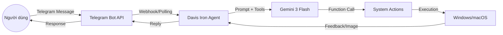

# 🤖 Davis Iron AI - Desktop AI Assistant via Telegram

[](https://aistudio.google.com/)
[](https://www.python.org/)
[](https://core.telegram.org/bots)

**Davis Iron AI** là một trợ lý ảo thông minh chạy trực tiếp trên máy tính của bạn, cho phép điều khiển từ xa thông qua ứng dụng Telegram. Được tích hợp sức mạnh từ **Gemini 1.5/2.0 Flash**, trợ lý này có khả năng hiểu ngôn ngữ tự nhiên và thực thi các lệnh hệ thống một cách chính xác.

---

## ✨ Tính năng nổi bật

- 🖥️ **Điều khiển OS**: Mở ứng dụng, thao tác file, mở trình duyệt bằng ngôn ngữ tự nhiên.
- 📸 **Screenshot**: Chụp ảnh màn hình và gửi trực tiếp qua Telegram.
- 🧠 **AI Brain**: Sử dụng Gemini Flash với cơ chế *Function Calling* để tự động chọn hành động phù hợp.
- 🛡️ **Bảo mật**: Chỉ cho phép chủ nhân (Whitelist Telegram ID) ra lệnh.
- ⚡ **Tốc độ**: Tối ưu hóa phản hồi với mô hình Flash nhanh và rẻ.

---

## 🏗️ Kiến trúc hệ thống



---

## 🛠️ Tech Stack

- **Ngôn ngữ chính**: [Python 3.10+](https://python.org)
- **AI Engine**: [Google Generative AI](https://pypi.org/project/google-generativeai/)
- **Bot Framework**: [python-telegram-bot](https://python-telegram-bot.org/)
- **Automation**: `pyautogui`, `subprocess`, `webbrowser`

---

## 🚀 Hướng dẫn bắt đầu

### 1. Yêu cầu hệ thống
- Python 3.10 hoặc cao hơn.
- Windows 10/11 (Hỗ trợ tốt nhất).
- Một tài khoản Telegram.
- Google AI Studio API Key.

### 2. Cấu trúc thư mục ưu tiên
```text
Davis-Iron-AI/
├── src/
│   ├── main.py             # Entry point
│   ├── bot_logic.py        # Xử lý Telegram
│   ├── ai_engine.py        # Logic Gemini & Function Calling
│   └── actions.py          # Thư viện lệnh hệ thống
├── .agent/                 # Tri thức & cấu hình Agent (Antigravity)
├── config/                 # Cài đặt ứng dụng
├── .env                    # Biến môi trường (API Keys)
└── requirements.txt        # Thư viện phụ thuộc
```

### 3. Cài đặt
```powershell
git clone https://github.com/your-username/DavisIronAI.git
cd DavisIronAI
pip install -r requirements.txt
```

### 4. Cấu hình (.env)
Tạo file `.env` tại thư mục gốc:
```env
GEMINI_API_KEY=your_gemini_api_key_here
TELEGRAM_BOT_TOKEN=your_telegram_bot_token_here
WHITELIST_USER_ID=your_telegram_id_here
```

---

## 📝 Demo Code Snippets

### Logic AI Engine (`ai_engine.py`)
```python
import google.generativeai as genai

def get_ai_response(user_input, tools):
    model = genai.GenerativeModel(
        model_name='gemini-1.5-flash',
        tools=tools
    )
    chat = model.start_chat(enable_automatic_function_calling=True)
    response = chat.send_message(user_input)
    return response.text
```

---

## 🔒 Bảo mật & Lưu ý
- **Whitelist**: Luôn kiểm tra `update.effective_user.id` trước khi xử lý tin nhắn.
- **Quyền hạn**: Trợ lý có quyền thực thi lệnh shell, hãy cẩn trọng khi định nghĩa các hàm tools.
- **Environment**: Luôn sử dụng biến môi trường để bảo vệ thông tin nhạy cảm.

---

**Copyright © 2024 by AcmaTvirus**  
*Built with ❤️ and AI Power.*